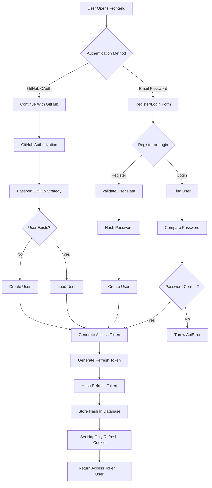
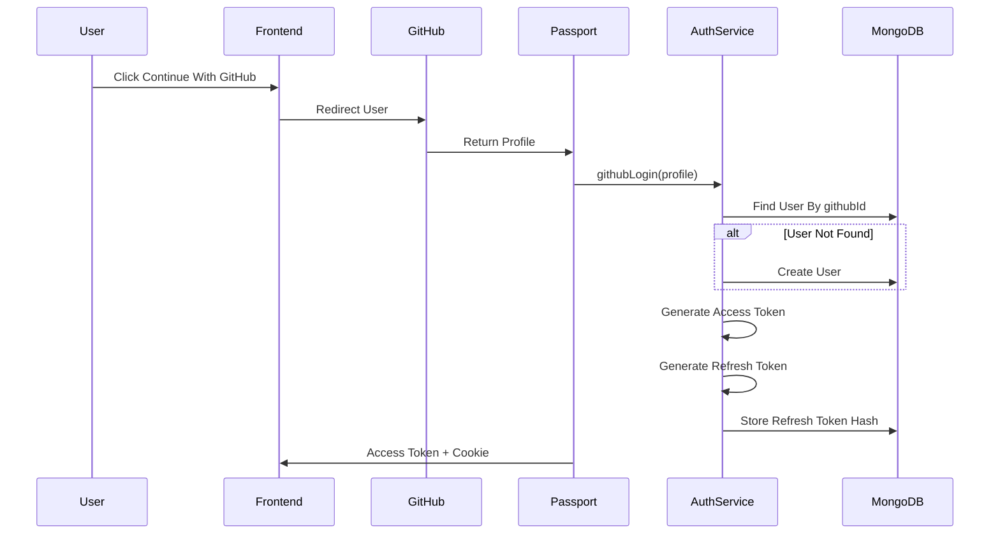
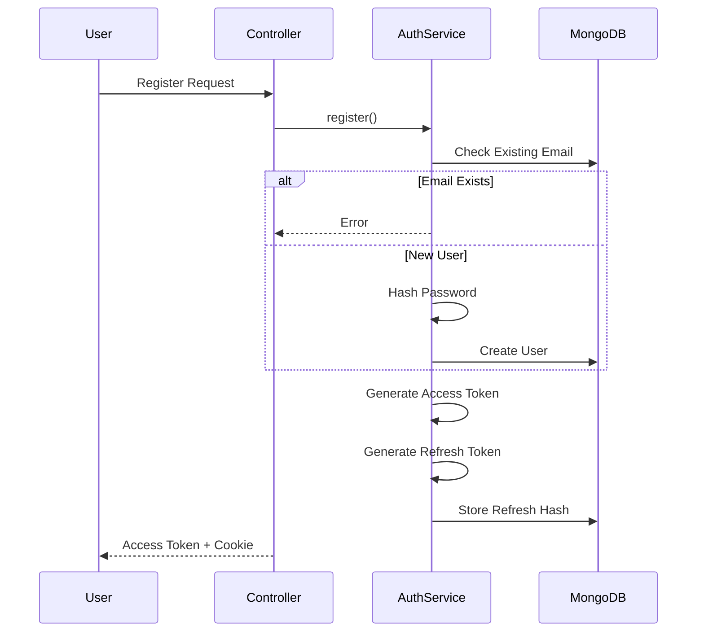
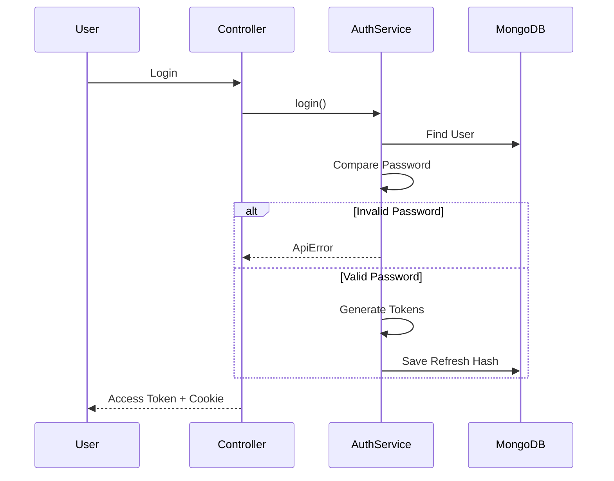
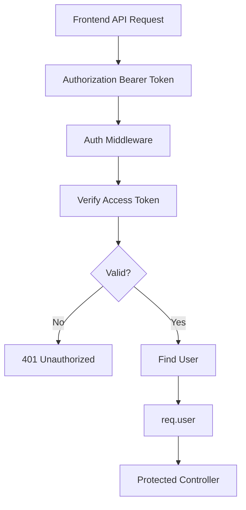
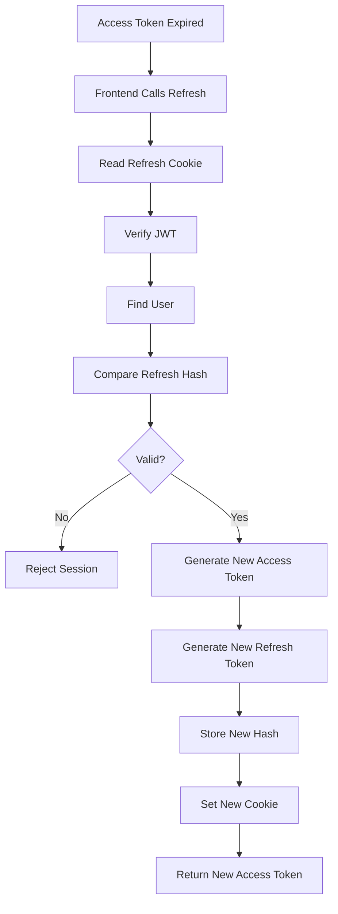
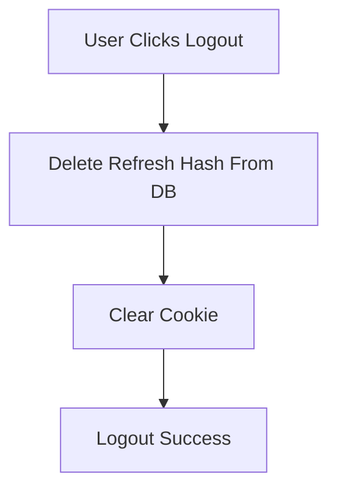
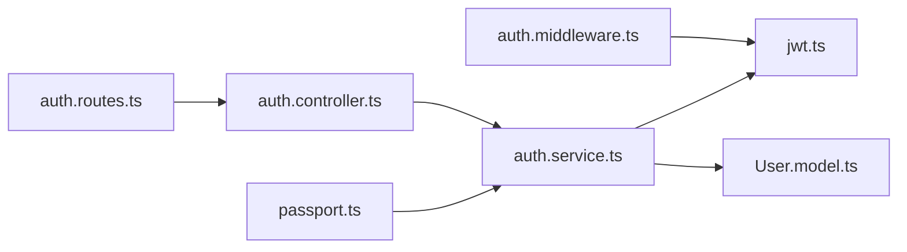
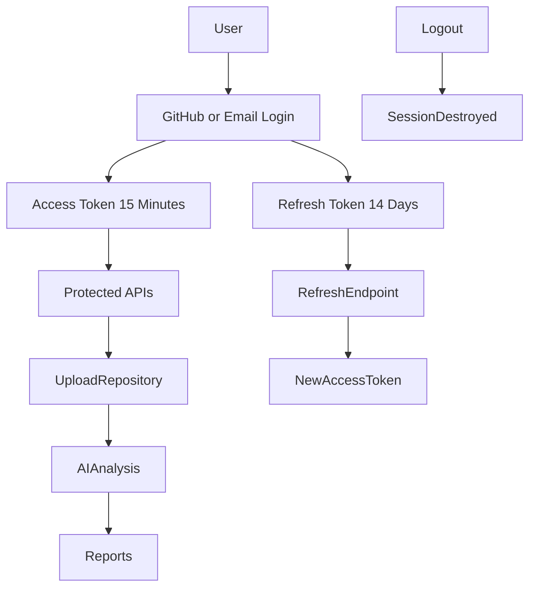

# DevDoctor AI Authentication Flow

This is how your authentication system should work from a high-level view.

---

## Overall Authentication Architecture



---

# What Happens During Login?

### GitHub Login



### What this means

GitHub is doing the identity verification.

You are doing:

```text
Find User
Create User
Generate Tokens
Create Session
```

---

# Email Registration Flow



---

# Email Login Flow



---

# Access Token Flow

The access token is used for every protected API request.



Example:

```http
GET /api/repos
Authorization: Bearer eyJhbGc...
```

---

# Refresh Token Flow

This is the most important part.



This process is called:

```text
Refresh Token Rotation
```

---

# Logout Flow



After logout:

```text
Old Refresh Token = Useless
Old Session = Invalid
```

---

# How Your Files Participate



---

# Current DevDoctor Authentication Lifecycle



# After Authentication Is Complete

Your next major feature becomes:

```text
Repository Upload
        ↓
Cloudinary Storage
        ↓
Repository Model
        ↓
BullMQ Queue
        ↓
AI Analysis Agent
        ↓
Report Generation
```

So think of Authentication as the **gatekeeper**. Once the user gets through this flow, everything else in DevDoctor AI (uploading repositories, generating reports, AI fixes, discussions) depends on the authenticated user identity.
